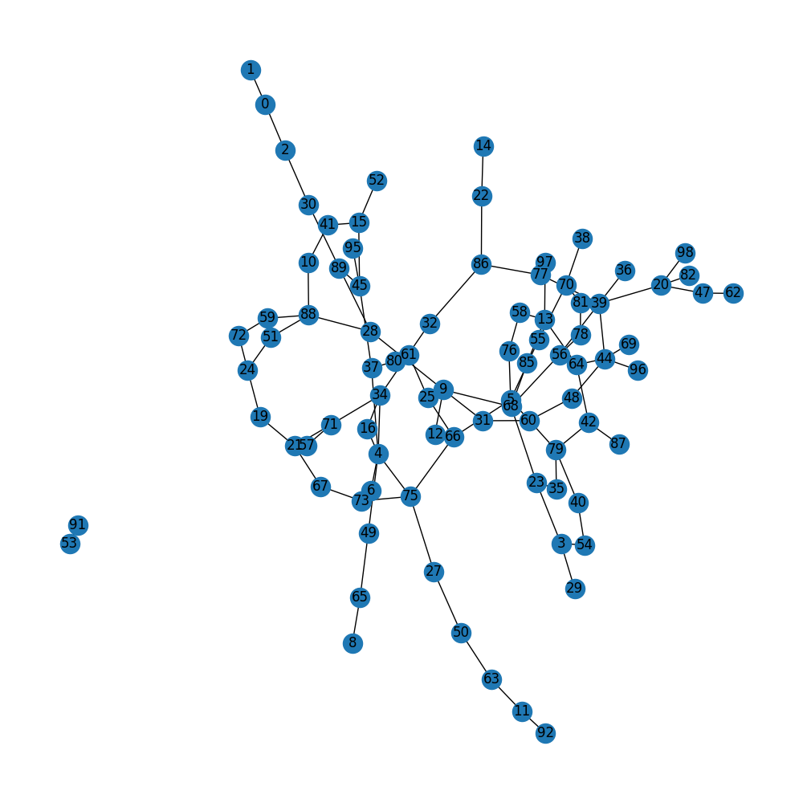
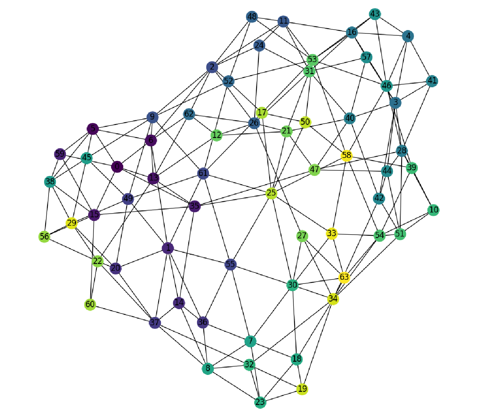

# GraphGeneration

In this repository, we will explore differents architectures to do graph generation. 

## Exploration

We will explore different architecture here : 

- GraphVAE (autoencoding with graph)
TODO later

- GraphGAN (GAN adaptation to graph)

- Diffusion (adaptation to latent diffusion model)

DiGress paper : https://arxiv.org/pdf/2209.14734.pdf (later)

GraphGDP paper : https://arxiv.org/pdf/2212.01842.pdf (currently coding)

- GRAN (recurrent generation) (implementation is done here)

Paper : https://arxiv.org/abs/1910.00760

## Running experimentation

```bash
cd scripts_training/
python train_erdos.py --dataset_type grid --batch_size 32
```

## Results

We did the experimentation for two algorithm GRAN (auto regressive) and graphGDP (diffusion / score generative model)

#### GRAN implementation

For the GRAN implementation, we achieve (visual) good generation :

For exemple for the grid graph the GRAN algorithm achieve almost perfectly to generate those graph :


Same thing for the watts strogatz graph (annealing graph : https://en.wikipedia.org/wiki/Watts%E2%80%93Strogatz_model)

Generated with GRAN :


Random generation with the networkx algorithm : 


For simple grid graph the GRAN achieve perfect representation :

GRAN generation :


Networkx generation :


#### GraphGDP implementation

Good result for the algorithm were harder to obtain, we only test it for grid like generation.

The generated graph look like this after training : 


It feels that the model could (almost) generate a planar graph, but were far from grid like.

For bigger grid size (10x10), we were also far although it has some planar vibe :


For this graphGDP, I feel I have to do some progress in the GNN architecture because the model have a good overall generated adjacency matrix
but a very bad topology :

Generated adjacency matrix :


Typical adjacency matrix for grid graph (networkx) :


The forward diffusion process also look good and the reverse too but the resulting topology doesn't look like a grid one ...

> ⚠️
> I did make some test changing the neural architecture using transformer based gnn (instead of message passing gnn) : it really make the grid generation works

#### G2PT implementation

Indeed when I adapt a transformer based architecture (https://arxiv.org/pdf/2501.01073) things start to work.

I also tried to adapt the LLaDa setup to graph transformer (https://arxiv.org/pdf/2502.09992) with success (it works greatly).

Tree and grid generation began to look like tree and grid ...

Example of generation of tree like network :



Ot planar graph network :




## Conclusion and key takeways

Important points :

- graph transformer is really superior (over classic message passing gnn) in term of graph generation (especially in diffusion setup)

- flattening the graph is key for performance (doing generation over edge index instead of adjacency matrix).

- you can use discrete diffusion setup (llada like) : it works well.

- Create a proper graph representation is really important : ordering nodes in BFS / DFS really improve the learning 


