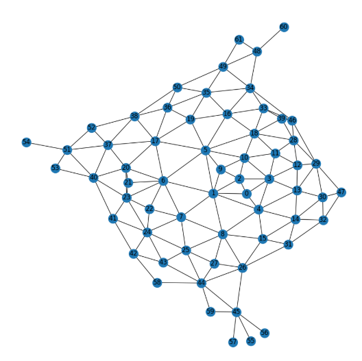

# GraphGeneration

**Description:**

DeepGraphGen is a repository dedicated to exploring and implementing various architectures for graph generation. This project investigates different approaches, including diffusion-based models and autoregressive models, to generate graphs with desired properties.

**Exploration:**

We explore the following architectures for graph generation:

- **Diffusion-based Models:**
    - **GraphGDP:** Implementation of GraphGDP model for graph generation (https://arxiv.org/pdf/2212.01842.pdf).
    - **DiGress:** Exploration of DiGress paper (https://arxiv.org/pdf/2209.14734.pdf) (to be implemented later).
    - **Discrete Diffusion (LLaDa-like):** Adaptation of LLaDa discrete diffusion for graph generation (https://arxiv.org/abs/2502.09992).

- **Autoregressive Models:**
    - **GRAN (Graph Recurrent Generation):** Implementation of GRAN model (https://arxiv.org/abs/1910.00760).
    - **G2PT (Graph Generative Pre-trained Transformer):** Implementation of G2PT model (https://arxiv.org/pdf/2501.01073).

**Datasets:**

We utilize toy graph datasets to evaluate the capabilities of the models:

- **Grid Dataset:** Simple grid graphs.
- **Tree Dataset:** Graphs in tree form.
- **Planar Dataset:** Set of planar graphs.
- **SMB Dataset:**  (Description needed)

**Results:**

Based on our experiments, **G2PT** and **discrete diffusion models** (like G2PT adapted for discrete diffusion) have shown the best performance in graph generation.

**Examples of Generation:**

- **Tree-like Network:**

  

- **Planar Graph Network:**

  

**Conclusion and Key Takeaways:**

- **Graph Transformers are Superior:** Graph transformers outperform traditional message-passing GNNs in graph generation tasks, especially in diffusion setups.
- **Flattening Graph Representation is Key:** Generating graphs over edge indices instead of adjacency matrices improves performance.
- **Discrete Diffusion Works Well:** Discrete diffusion setups (LLaDa-like) are effective for graph generation.
- **Proper Graph Representation is Crucial:** Ordering nodes using BFS/DFS significantly enhances learning.

